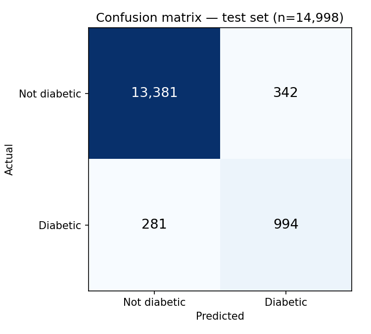
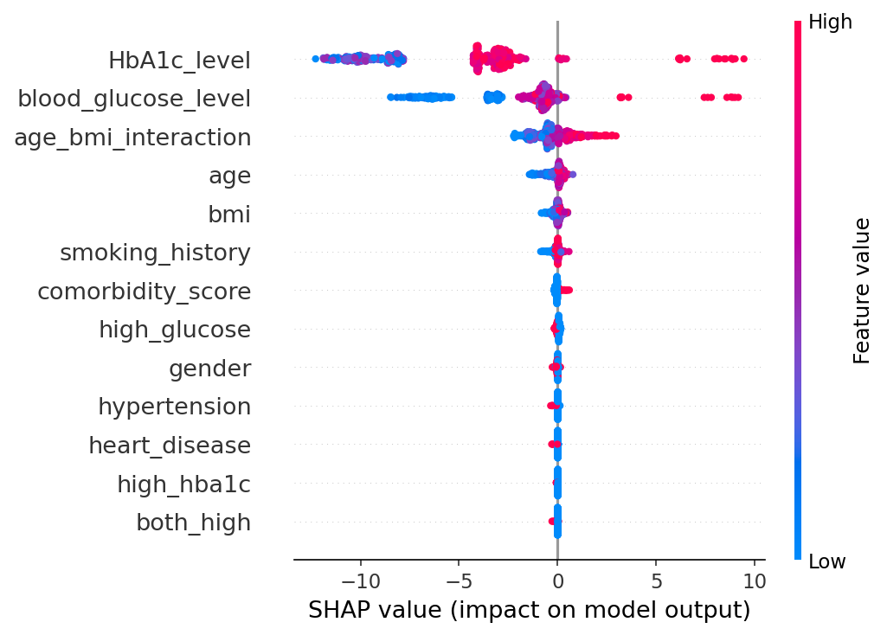

# Diabetes Risk Prediction

Stacking ensemble (LightGBM + XGBoost + CatBoost) predicting diabetes risk
from routine clinical measurements. SHAP for feature attribution, LLM layer
on top to phrase it in plain language.

**Test set: ROC-AUC 0.977 · PR-AUC 0.879 · Recall 0.78 · Precision 0.74**

## The actual problem

The dataset is ~91.5% non-diabetic. A model that predicts "no diabetes"
for everyone scores 91.5% accuracy and catches zero real cases. So
accuracy isn't the metric that matters here. The real questions are how
you evaluate this honestly under that imbalance, where you set the
threshold when missing a diabetic is worse than a false alarm, and how
you explain a stacking ensemble's output to someone who isn't reading a
SHAP plot.

## Fixed a leakage bug

Earlier version tuned ensemble weights and the decision threshold by
grid-searching for whatever maximized accuracy on the test set. That's
leakage. The "test" numbers weren't a real generalization estimate,
because model selection had already seen that exact data.

Fixed with a proper split: train models on 70%, tune weights/threshold on
a 15% validation set (by F1, not accuracy), evaluate on the last 15% once
and never touch it again. There's a regression test for this
(`test_encoders_are_fit_on_train_only_not_full_data`) so it can't quietly
come back.

For what it's worth, fixing it barely moved the number: 96.0% claimed
accuracy vs. 95.8% honest accuracy. Dataset's big enough that the leakage
didn't do much damage in practice. Still wrong to do it, and now it's
actually fixed instead of just less-bad.

## Metrics

```
ROC-AUC   0.977
PR-AUC    0.879
Precision 0.744
Recall    0.780
F1        0.761
Brier     0.034

Confusion matrix:  TN=13381  FP=342  FN=281  TP=994
Missed 281 of 1,275 true diabetic cases (22%)
```



The 22% miss rate is the number I'd lead with, not accuracy. Threshold is
currently set to the F1-optimal point on validation; `src/train.py` has
the full precision/recall grid if it needs to move toward higher recall
for a real screening use case.

## Subgroup check (gender)

| | n | Positive rate | Recall | Precision |
|---|---|---|---|---|
| Female | 8,713 | 7.6% | 0.793 | 0.705 |
| Male | 6,285 | 9.8% | 0.765 | 0.792 |

~3 point recall gap. Could be noise at this sample size, could be real.
Reporting it either way.

## SHAP + LLM explanations

SHAP gives feature attributions as numbers. The LLM layer (`src/explain.py`)
turns a given patient's SHAP output into a sentence. It only ever sees
the SHAP values, never raw patient data. It summarizes the attributions
it's given rather than making an independent prediction; that scopes what
it can say, though it's still a model call, so the wording itself isn't
guaranteed to be perfect even when the underlying numbers are.



HbA1c and blood glucose dominate, which matches how these are actually
diagnosed clinically. No surprises there, which is itself a reasonable
sanity check on the model.

```
TRUE POSITIVE (risk 100%, actual: diabetic)
HbA1c level, age×BMI interaction, and age pushed risk up.

FALSE NEGATIVE (risk 20.2%, actual: diabetic)
HbA1c and glucose pushed risk down; age×BMI pushed it up. Model missed
this one on the two strongest lab features not flagging despite the
true outcome being diabetic.
```

No API key set → falls back to a templated version of the same sentence
instead of breaking.

## Structure

```
src/
  features.py     - clinical feature engineering, fixed ADA thresholds
  pipeline.py      - train/val/test split, encoders fit on train only
  train.py         - base models + ensemble tuning (val only)
  evaluate.py      - test metrics + subgroup check
  explain.py       - SHAP + LLM explanation layer
  main.py          - full run
  demo_explain.py  - per-patient explanation demo
tests/
  test_features.py
  test_pipeline.py  - split integrity, leakage regression guard
reports/
  test_metrics.json
```

## Running it

```bash
pip install -r requirements.txt
PYTHONPATH=. python -m pytest tests/ -v
PYTHONPATH=. python -m src.main
PYTHONPATH=. python -m src.demo_explain
```

Set `ANTHROPIC_API_KEY` for LLM-phrased explanations, otherwise it uses
the template.

## Limitations

- Dataset's synthetic (Kaggle), not real clinical records. Real-world
  noise and missingness would likely hurt these numbers.
- Screening aid, not diagnosis. 22% miss rate matters in a real clinical
  setting; threshold should get set by whoever owns that tradeoff, not
  default to F1.
- Fairness check only covers gender, and only the two categories with
  enough samples to say anything reliable (dropped ~18 rows labeled
  "Other" for that reason). Doesn't cover other attributes.
- LLM explanation is constrained to the SHAP numbers it's given, but it's
  still a model call. The template fallback exists partly because a demo
  shouldn't depend on an API being up.
